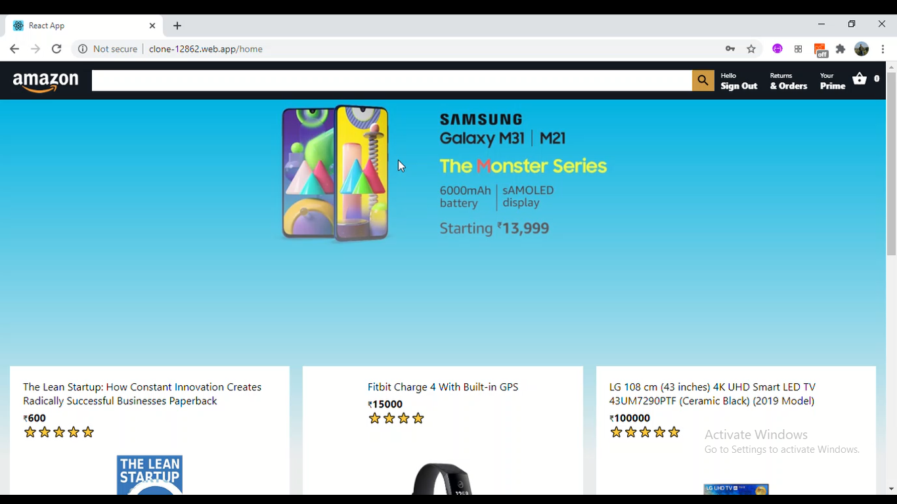

## Amazon Clone

 
 

 
This is an Amazon Clone created using React JS as Front end , Firebase for Deployment and the backend purpose

## Link

[https://clone-12862.web.app/](https://clone-12862.web.app/)

